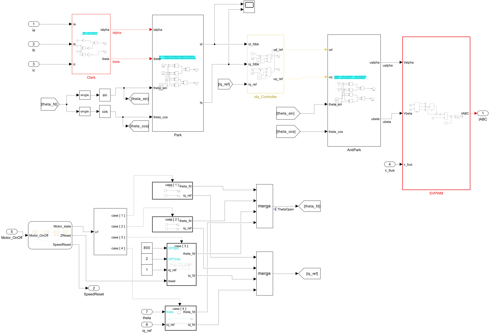

# Simulink FOC Skills

能够和官方的skill和mcp强强联合的两个Skill，需要配置官方项目：
- [Simulink Agentic Toolkit](https://github.com/simulink/simulink-agentic-toolkit)
- [MATLAB Agentic Toolkit](https://github.com/matlab/matlab-agentic-toolkit)
- [MATLAB MCP Core Server](https://github.com/matlab/matlab-mcp-core-server)
# 本skill的链接发给codex让他给你配置就好，因为我的README里面已经写出官方项目的链接。
## 1. `embedded-foc-simulink-codegen`

FOC 执行 Skill。负责 PMSM/BLDC 的 Clarke/Park、dq 电流环、速度环、SVPWM、启动切换、转子反馈、多速率时序、嵌入式接口和受控代码生成。

## 2. `simulink-model-auditor`

通用审计 Skill。可以审计任意 Simulink 模型或子系统，不限于 FOC。检查求解器、采样率、结构连接、模型引用、库链接、数据字典、编译数据类型和代码生成配置；对 FOC 模型再增加 PI、Rate Transition、控制器边界和启动相关专项检查。

## 模型展示

### FOC 闭环仿真系统

控制器与逆变器、PMSM 电机对象分离，形成完整的闭环仿真平台。

[](skills/embedded-foc-simulink-codegen/assets/speedloop-system-overview.png)

### FOC 控制器架构

速度环生成 q 轴电流参考，快速电流环完成坐标变换、电流调节和 PWM 调制。

[](skills/embedded-foc-simulink-codegen/assets/foc-controller-architecture.png)

### dq 电流环与 SVPWM

快速控制链包含 Clarke、Park、dq 电流 PI、反 Park、SVPWM、启动和闭环切换逻辑。

[](skills/embedded-foc-simulink-codegen/assets/foc-current-loop.png)

## 为什么是强强联合

这个仓库不是重复实现通用 Simulink 工具，而是在 MathWorks 官方 Simulink Skills 和 MATLAB MCP 之上增加 FOC 专业能力与工程门禁。

| MathWorks 官方 Skill/MCP | 本仓库的两个 Skill | 联合后的效果 |
| --- | --- | --- |
| `model_overview`、`model_read`、`model_query_params` | FOC 架构、角度约定、启动切换和多速率规则 | 先理解真实模型，再作专业判断，减少凭名称猜测 |
| `model_edit`、`model_check` | 控制器/电机边界和可生成代码约束 | 形成“读取 → 修改 → 复查 → 结构检查”的闭环 |
| `SimulationInput`、`model_test` | 启动、反转、负载阶跃、故障和抗饱和场景 | 将 FOC 要求转成可重复的仿真与行为测试 |
| 项目、数据字典和模型引用管理 | 标定参数、固件接口与所有权规则 | 模型、数据和生成代码接口保持一致 |
| Model Advisor 与 MATLAB 静态分析 | 通用审计 + FOC 专项审计 | 同时获得官方检查证据和领域风险报告 |
| MATLAB/Simulink/Embedded Coder 执行能力 | deployment profile、硬件安全清单和显式授权 | 审计有 FAIL 或未明确授权时拒绝调用 `slbuild` |

官方工具负责可靠地操作和检查模型；`embedded-foc-simulink-codegen` 负责把 FOC 做正确；`simulink-model-auditor` 负责判断模型是否具备继续验证或部署的条件。三者组合后，AI 不只是“会画 Simulink 模型”，而是能够按可追溯、可测试、可审计的工程流程工作。


## 安装

先克隆仓库，再把两个 Skill 目录复制到 Codex 的 skills 目录：

```powershell
git clone https://github.com/YANG985-CMD/embedded-foc-simulink-codegen.git .\simulink-skills
Copy-Item .\simulink-skills\skills\embedded-foc-simulink-codegen `
  "$HOME\.codex\skills\embedded-foc-simulink-codegen" -Recurse
Copy-Item .\simulink-skills\skills\simulink-model-auditor `
  "$HOME\.codex\skills\simulink-model-auditor" -Recurse
```

也可以只安装其中一个。要使用代码生成门禁，必须同时安装两个 Skill。

## 使用示例

审计任意模型：

```text
使用 $simulink-model-auditor 审计这个 Simulink 模型。先调用官方
model_overview、model_read、model_check，再运行 simulation profile 的本地审计。
不要修改模型，也不要生成代码。
```

执行 FOC 修改：

```text
使用 $embedded-foc-simulink-codegen 创建一个 STM32G4 PMSM FOC 控制器。
严格使用官方 Simulink MCP 修改模型；完成后调用 $simulink-model-auditor 做通用审计和 FOC 专项审计。
```

## 本地审计脚本

```matlab
addpath('skills/simulink-model-auditor/scripts');

% 任意 Simulink 模型
generic = audit_simulink_model('any_model.slx', ...
    'Profile', 'simulation', ...
    'OutputFile', 'artifacts/simulink-audit.json');

% FOC 专项审计
foc = audit_embedded_foc_model('motor_control.slx', ...
    'ControllerPath', 'motor_control/FOC_Controller', ...
    'Profile', 'deployment', ...
    'OutputFile', 'artifacts/foc-audit.json');
```

审计脚本只读模型，不会保存修改。`READY` 只表示脚本检查通过，不等于功能正确、标准合规或硬件安全；仍需官方 `model_test`、Model Advisor、SIL/PIL、目标机时序和硬件保护验证。

## 代码生成门禁

```matlab
addpath('skills/simulink-model-auditor/scripts');
addpath('skills/embedded-foc-simulink-codegen/scripts');
build = run_embedded_foc_codegen('motor_control.slx', ...
    'ControllerPath', 'motor_control/FOC_Controller', ...
    'ConfirmBuild', true);
```

没有明确的 `ConfirmBuild=true`，或通用/FOC deployment audit 存在 FAIL，脚本不会调用 `slbuild`。

## 验证

```matlab
results = runtests('tests');
assertSuccess(results);
```

GitHub Actions 使用 MathWorks 官方 `setup-matlab@v3` 和 `run-tests@v3`，以 R2024b 作为稳定测试基线；CI 不执行真实 Embedded Coder 构建。

## 目录

```text
skills/embedded-foc-simulink-codegen/  FOC 执行 Skill
skills/simulink-model-auditor/        通用 + FOC 审计 Skill
tests/                                两个 Skill 的 MATLAB utility tests
.github/workflows/matlab-tests.yml    GitHub Actions
```
