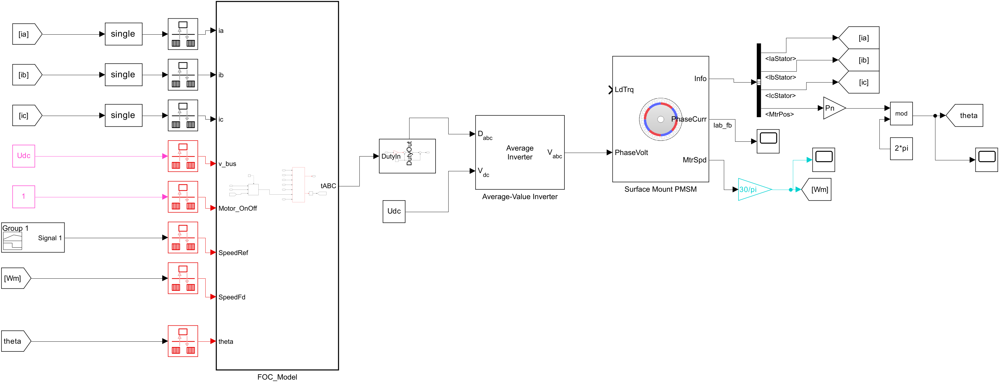
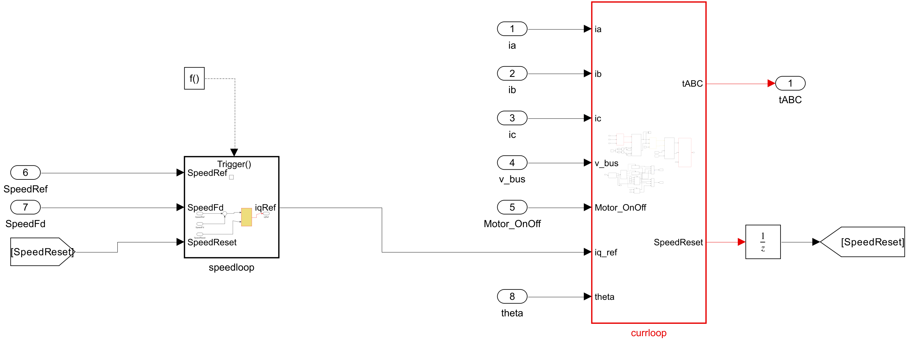

# Embedded FOC Simulink Codegen

面向 PMSM/BLDC 矢量控制的 Simulink 建模与嵌入式代码生成 Skill。它可以指导 Codex 构建、修改和审查 FOC 控制模型，覆盖闭环仿真、控制器分层、多速率调度、启动与转子位置反馈，并将控制算法整理成适合 STM32/ARM Cortex-M 部署的 ERT C 代码组件，建议搭配MATLAB官方的MCP和simulink skill使用：https://github.com/matlab/simulink-agentic-toolkit

## 模型展示

### FOC 闭环仿真系统

控制器与逆变器、PMSM 电机对象分离，控制输入经过数据类型转换和速率边界后进入 `FOC_Model`。

[](assets/speedloop-system-overview.png)

### FOC 控制器架构

速度环生成 q 轴电流参考，快速电流环完成电流调节、坐标变换和 PWM 调制，并通过复位信号协调控制状态。

[](assets/foc-controller-architecture.png)

### dq 电流环与 SVPWM

快速控制链包含 Clarke、Park、dq 电流 PI、反 Park、SVPWM，以及使能、开环启动和闭环切换逻辑。

[](assets/foc-current-loop.png)

## 核心能力

- 构建 Clarke、Park、反 Park、dq 电流 PI、速度 PI 和 SVPWM。
- 组织电流环、速度环、模式管理、保护限幅和启动状态机。
- 支持编码器、Hall、Luenberger、SMO、EKF 等转子位置与速度反馈方案。
- 搭建逆变器、PMSM、负载、传感器和测试激励组成的闭环仿真平台。
- 依据 PWM/ADC 时序设计电流环与速度环采样周期和跨速率数据传输。
- 配置固定步长、`single` 数据、数据字典、ERT、C99 和 ARM Cortex-M 目标。
- 定义生成代码的输入输出、标定参数、入口函数和 MCU 调度契约。
- 审查求解器、采样时间、原子边界、Rate Transition、PI 设置、字典和代码生成风险。

## 推荐架构

```text
Simulation Harness
├─ Command / Fault Stimulus
├─ Feedback Sampling and Type Conversion
├─ FOC_Controller or FOC_Model
│  ├─ CommandAndModeManager
│  ├─ SpeedLoop                         slow task
│  ├─ CurrentLoop                       PWM/ADC fast task
│  │  ├─ Clarke
│  │  ├─ Park
│  │  ├─ DqCurrentController
│  │  ├─ InversePark
│  │  └─ SVPWM
│  ├─ StartupAndHandoff
│  ├─ RotorFeedback                     Hall/encoder/observer
│  └─ ProtectionAndLimits
├─ Inverter and PMSM Plant              simulation only
└─ Logging / Assertions / Scopes        simulation only
```

控制器与仿真对象采用清晰边界：电机、逆变器、测试信号和 Scope 留在仿真平台中，生成代码的控制器只保留采样输入、FOC 算法、状态与保护逻辑以及占空比输出。

## 建模流程

1. 单独验证 Clarke、Park 和反 Park 的比例、相序、角度方向与往返误差。
2. 构建 SVPWM、逆变器和 PMSM 平台，使用开环旋转电压验证相序和调制方向。
3. 闭合 dq 电流环，加入电流限幅、电压矢量限幅和抗积分饱和。
4. 建立使能、转子定位、开环加速、闭环切换和故障状态。
5. 增加速度环，并把 `iq_ref` 限制在电机与逆变器允许范围内。
6. 接入 Hall、编码器或无感观测器，并定义角度与速度有效状态。
7. 完成定步长、多速率、数据字典和 ERT 代码生成配置。
8. 通过模型更新、闭环场景、代码构建、SIL/PIL 和目标机时序测试逐层验证。

## 多速率与嵌入式执行

快速电流任务应与 PWM 更新或 ADC 采样事件同步。速度任务和其他慢速任务应为快速任务的整数倍：

```text
Ts_speed = N × Ts_current, N 为正整数
```

每个跨速率信号都应明确保持、延迟、锁存或缓冲方式，并使用 Rate Transition、函数调用子系统、模型引用速率或固件调度器实现确定性传输。

典型固件映射：

| 执行入口 | 触发来源 | 主要功能 |
| --- | --- | --- |
| Current step | PWM/ADC 中断 | 电流采样、坐标变换、dq PI、SVPWM |
| Speed step | 定时器或整数分频 | 速度 PI、`iq_ref` 限幅 |
| Background | 主循环或 RTOS 低优先级任务 | 标定、通信、非关键诊断 |

## 安装

将仓库克隆到 Codex Skills 目录：

```powershell
git clone https://github.com/YANG985-CMD/embedded-foc-simulink-codegen.git `
  "$HOME\.codex\skills\embedded-foc-simulink-codegen"
```

重新启动 Codex 会话后使用：

```text
$embedded-foc-simulink-codegen
```

## 使用示例

```text
使用 $embedded-foc-simulink-codegen 创建一个用于 STM32G4 的 PMSM FOC 控制器，
电流环由 PWM/ADC 中断触发，速度环采用 10 倍分频，并生成 ERT C99 代码。
```

```text
使用 $embedded-foc-simulink-codegen 审查当前 FOC_Model，检查采样率、
PI 抗饱和、启动切换、数据字典、ERT 配置和生成代码接口。
```

```text
使用 $embedded-foc-simulink-codegen 为当前模型设计 Hall 与 SMO 可切换的
RotorFeedback，保持已有 FOC_Model 端口和固件接口不变。
```

## 模型自动审计

仓库提供只读 MATLAB 审计脚本：

```matlab
addpath('scripts');
report = audit_embedded_foc_model('D:/project/motor_control.slx');
```

控制器使用其他名称时，可以指定边界：

```matlab
report = audit_embedded_foc_model('motor_control.slx', ...
    'ControllerPath', 'motor_control/MotorControl');
```

审计结果包含 PASS、WARN 和 FAIL，并返回：

- 求解器、基准步长和代码生成目标；
- 控制器端口、原子属性与采样时间；
- 数据字典路径与文件名大小写；
- PI、Rate Transition 和函数调用发生器配置；
- 仿真模块是否进入生成代码边界；
- 控制器速率与模型基准步长是否一致。

审计脚本不会保存模型，也不能替代闭环仿真、ERT 构建、SIL/PIL 和目标机最坏执行时间测试。

## 文件结构

```text
embedded-foc-simulink-codegen/
├─ SKILL.md
├─ README.md
├─ agents/
│  └─ openai.yaml
├─ assets/
│  ├─ foc-controller-architecture.png
│  ├─ foc-current-loop.png
│  └─ speedloop-system-overview.png
├─ scripts/
│  └─ audit_embedded_foc_model.m
└─ references/
   ├─ control-architecture.md
   ├─ embedded-codegen-contract.md
   ├─ reference-findings.md
   ├─ style-guide.md
   └─ verification-checklist.md
```

## 环境依赖

- MATLAB 与 Simulink；
- ERT 代码生成通常需要 Embedded Coder；
- 电机与逆变器对象可能需要 Simscape Electrical 或 Motor Control Blockset；
- SIL/PIL、模型测试和目标支持能力取决于已安装的 MathWorks 产品与 MCU 支持包。
